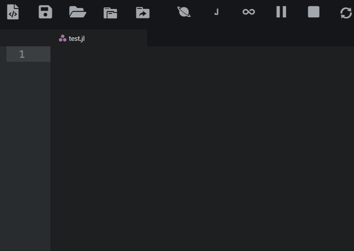
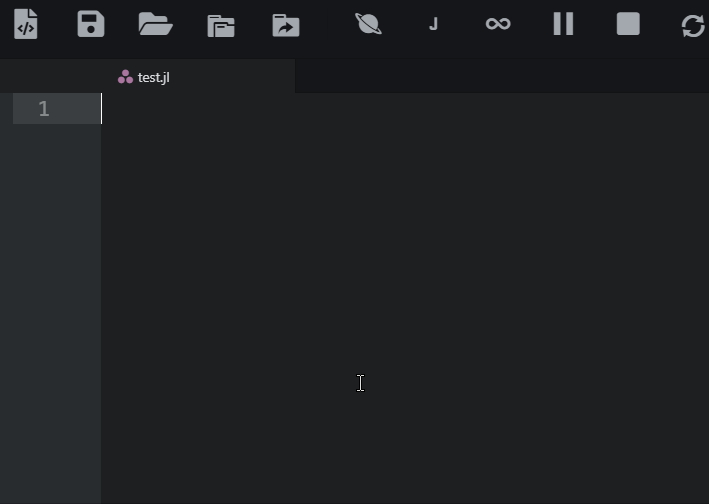
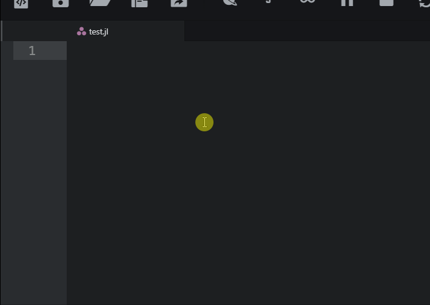

# juno-plus Atom package
This is an Atom's package that enhances Julia IDE (Juno) by adding some useful buttons and code snippets.

### Atom Installation
https://atom.io/packages/juno-plus

After installation, if the Julia Client icons are still present, you might need to reload/restart Atom 2 times! (because this package adjusts Julia Client and Tool-bar config settings).

#### VSCode - Sublime Installation

Converted code snippets are available under `snippets_converted` folder.

## Buttons

### Files and Folders
* Open Folder - useful for opening and developing a project/package
* Select Julia working directory

### Process:
* using Revise
* Restart Julia (which removes workspace)
* Erase console

### Evaluation and Debugging:
* Run cell
* Debug: Run File
* Debug: Step into File

### Code Tools:
* Show documentation of the selection
* Go to definition of the selection
* Bookmarks
* Fold all - Unfold all: useful for code overview
* Auto Indent Selection (faster than Julia-Client formatting button)

### Viewers:
* Markdown preview: for previewing Readme.md if the package is already installed

### Atom utilities:
* Open Settings
* Fullscreen
* Command Palette
* Restart Juno

## Julia Snippets

To use snippets type the keyword `without space`.

There are some cool snippets in this package. For example:

`switch-case`:

`do-while`:

`!.`:

### Basics and Arithmetic
Snippet Description | Keyword
--|--
Swap | swap
Constant | const
!. | !.
null | null
nan | nan

## Commenting
Snippet Description | Keyword
--|--
Separator | sep
Comment Block | com

## Strings and Characters
Snippet Description | Keyword
--|--
Triple " | q3
Charecter Code | char code
Charecter from Code | char from code
UTF charecter | utf
Loop through charecters | for char
First matching string | findfirst string
Find and replace string | replace string

## Types  
Snippet Description | Keyword
--|--
Int | int
UInt | uint
Float32 | single
Float64 | double
Parametric type | Type parametric
Union{} | Union
Union{Nothing,type} | UN
where | where
where multi | where multi
where <: | where upper
UnionAll using where | UnionAll where
Parametric abstract type | abstract type parametric
typeof subtype | typeof subtype
typeof isa | typeof isa

## Structs
Snippet Description | Keyword
--|--
inherited Struct | struct inherited
Parametric Struct | struct parametric
Parametric inherited Struct | struct parametric inherited
Struct field names | struct field names
Struct field types | struct field types

## Conditionals
Snippet Description | Keyword
--|--
switch | switch case
if elseif | if elseif
try catch full | try catch full

## Loops
Snippet Description | Keyword
--|--
enumeration - index, value | for enumerate
nested loop - i,j | for nested
do while | do while
break | break
continue | continue
while with break | while break
for with break | for break
for with continue | for continue

## Functions - Docstring
Snippet Description | Keyword
--|--
Documented Function with Examples | function doc example
Function Full | function full
Docstring | doc
Docstring with Examples | doc example
Julia Example block | example

## Dictionaries - Collections
Snippet Description | Keyword
--|--
key => val pair | pair
Dict pair | Dict pair
Dict keys | Dict keys
Dict values | Dict values
Loop through key-value pairs | for Dict

## Regex Snippets
Snippet Description | Keyword
--|--
Regex literal | reg

## Regex Syntax  
Snippet Description | Keyword
--|--
Regex Start | reg start
Regex End | reg end
Regex Anything except newline | reg any except newline
Regex or | reg or
Regex escape | reg escape
Regex previous 0<= time | reg 0 or more
Regex previous 1<= time | reg 1 or more
Regex previous 0 or 1 time | reg 0 or 1
Regex previous n times | reg n times
Regex previous n<= times | reg n or more
Regex previous n1-n2 times | reg n1 n2
Regex whitespace char | reg whitespace
Regex non-whitespace char | reg non-whitespace
Regex word char | reg word
Regex non-word char | reg non-word
Regex digit char | reg digit
Regex non-digit char | reg non-digit
Regex backspace char | reg backspace
Regex control char | reg backspace
Regex newline | reg newline
Regex tab | reg tab
Regex carriage return | reg carriage return
Regex null | reg null
Regex vertical tab | reg vertical tab
Regex octal character ZZZ | reg octal
Regex hex character ZZ | reg hex
Regex group | reg group
Regex backreference group | reg backreference
Regex Non-capturing group | reg group non-capturing
Regex any of | reg any of
Regex not | reg not
Regex among char | reg among char
Regex among digits | reg among number
Regex positive lookahead group | reg group positive lookahead
Regex negative lookahead group | reg group negative lookahead
Regex negative lookbehind | reg group negative lookbehind
Regex Word Boundary | reg word boundary

## Regex Common
## Numbers
Snippet Description | Keyword
--|--
Regex whole numbers | regc numbers whole
Regex decimal number | regc numbers decimal
Regex whole + decimal number | regc numbers whole + decimal
Regex negative, positive whole + decimal number | regc numbers negative, positive whole + decimal
Regex whole + decimal + fractions numbers | regc numbers whole + decimal + fractions

## Strings  
Snippet Description | Keyword
--|--
Regex slug | regc slug
Regex duplicates | regc duplicates

## Alphanumeric Characters
Snippet Description | Keyword
--|--
Regex alphanumeric without space | regc alphanumeric without space
Regex alphanumeric with space | regc alphanumeric with space

## File Path
Snippet Description | Keyword
--|--
Regex file path with filename.extension | regc file path with filename.extension
Regex file path with optional filename.extension | regc file path optional filename.extension
Regex filename.extension (3 chars) | regc filename.extension

## Dates
Snippet Description | Keyword
--|--
Regex date YYYY-MM-dd | regc date YYYYMMdd
Regex date dd-MM-YYYY using -,. , / with check for leap year | regc date ddMMYYYY
Regex date dd-mmm-YYYY using separators -, ., / | regc date ddmmmYYYY

## Time
Snippet Description | Keyword
--|--
Regex time HH:MM 12-hour, optional leading 0 | regc time HHMM 12h optional leading 0
Regex time HH:MM 12-hour AM/PM optional leading 0 | regc time HHMM 12h AM/PM optional leading 0
Regex time HH:MM 24-hour with leading 0 | regc time HHMM 24h with leading 0
Regex time HH:MM 24-hour, optional leading 0 | regc time HHMM 24h, optional leading 0
Regex time HH:MM:SS 24-hour | regc time HHMMSS 24h

## Email  
Snippet Description | Keyword
--|--
Regex email common | regc email common
Regex email uncommon | regc email uncommon

## Password Strength
Snippet Description | Keyword
--|--
Regex password complex | regc password complex
Regex password moderate | regc password moderate

## Username  
Snippet Description | Keyword
--|--
Regex username | regc username

## URL  
Snippet Description | Keyword
--|--
Regex url http(s) | regc url http(s)
Regex url protocol optional | regc url optional protocol

## IP Address  
Snippet Description | Keyword
--|--
Regex IPv4 address | regc IPv4
Regex IPv6 address | regc IPv6
Regex IPv4 or IPv6 address | regc IPv4 or IPv6

## Identity Documents  
Snippet Description | Keyword
--|--
Regex passport | regc passport

## Weave Snippets

Snippet Description | Keyword
--|--
Hidden Output for Julia code chunk | out julia false
Non Echoed Julia code chunk | echo julia false
Evaluated Julia code chunk | eval julia true
Non-evaluated Julia code chunk | eval julia false
Terminal Julia code chunk | term julia
Hold the output for a Block of Julia code chunk | hold julia
Inline Julia Code | inline
Latex | latex
Separator | sep

Repo: https://github.com/aminya/juno-plus

If you have any suggestions, I would be happy to include.
